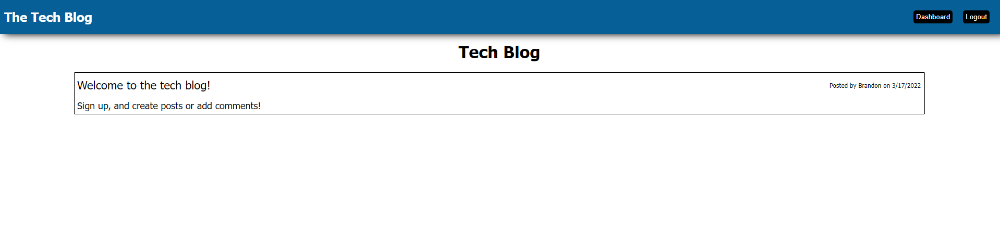

  # Tech Blog

  
  
  ## Description
  An blog application where users can create posts, and comment on posts.
  ## Table of Contents 
  
  - [Installation](#installation)
  - [Usage](#usage)
  - [License](#license)
  - [Questions](#questions)
  
  ## Installation
  - To install, click the green code button. Download the zip file and unpack. Open in your favourite code editor.
  - Open server.js and open the terminal
  - In the terminal run "npm i"
  - Create a .env file with 
  ```
DB_NAME=tech_blog_db
DB_PASSWORD=password
DB_USER=root
```
  - In the termianl run "npm start"
  - Open browser and navigate to localhost:3005

  ## Usage
  [DEMO APP](https://brandon-techblog.herokuapp.com/)

  
  
  
  ## License
  [APACHE](https://www.apache.org/licenses/LICENSE-2.0.txt)
  
  ## Questions
  
  [GitHub Profile](https://github.com/bdubz93).
  
  Questions? You can email me at brandonwinkler@live.ca.
